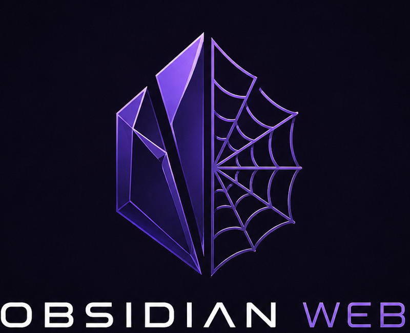

<p align="center">
  
</p>

<p align="center">
  A self-hosted web interface for accessing and interacting with an Obsidian vault.
</p>

---

# Obsidian Web

Obsidian Web is a self-hosted web application that provides a browser-based interface for accessing and interacting with an [Obsidian](https://obsidian.md/) vault.

The application works directly with the Markdown files of an existing Obsidian vault while keeping the vault itself under your control.

> **Note:** Obsidian Web is currently under active development. Authentication and additional access controls are not implemented yet and should be considered before exposing the application to the public internet.

## ✨ Features

* 🌳 Browse the Obsidian vault through a file tree
* 📄 View Markdown notes in the browser
* 🔗 Resolve and navigate Obsidian WikiLinks
* 🏷️ Browse notes by tags
* 🔎 Search notes
* 📅 Daily dashboard
* ☑️ Task dashboard
* 📥 Create and edit notes through a dedicated Inbox
* 📝 Markdown rendering
* 📊 Dashboard widgets
* 🖼️ Display assets from the vault
* 🔄 Refresh vault contents
* 🌐 Self-hosted architecture
* 🐳 Docker deployment

## 🖥️ Screenshots

<!-- Add screenshots here later -->

## 🏗️ Architecture

Obsidian Web consists of a React frontend and a FastAPI backend.

### Docker Architecture

When running with Docker, Nginx serves the frontend and acts as a reverse proxy for the backend API.

```text
                         ┌─────────────────────┐
                         │      Web Browser    │
                         │                     │
                         │   React Application │
                         └──────────┬──────────┘
                                    │
                              HTTP :80
                                    │
                                    ▼
                         ┌─────────────────────┐
                         │       Frontend      │
                         │                     │
                         │       Nginx         │
                         │                     │
                         │   /      → React   │
                         │   /api/* → Backend  │
                         └──────────┬──────────┘
                                    │
                             Docker network
                                    │
                                    ▼
                         ┌─────────────────────┐
                         │       Backend       │
                         │                     │
                         │   FastAPI + Python  │
                         │      Uvicorn        │
                         └──────────┬──────────┘
                                    │
                                    ▼
                         ┌─────────────────────┐
                         │    Obsidian Vault   │
                         │                     │
                         │   Markdown files    │
                         │      + assets       │
                         └─────────────────────┘
```

The backend is not exposed directly to the host. API requests are routed through Nginx using the `/api/` path.

### Frontend

* React
* TypeScript
* Vite
* React Router
* Nginx for production serving

### Backend

* Python
* FastAPI
* Uvicorn

### Data

The application works directly with the Markdown files and assets of an Obsidian vault.

No separate database is required for the core vault functionality.

## 📁 Project Structure

```text
Obsidian-Web/
│
├── frontend/
│   ├── src/
│   │   ├── api/
│   │   ├── components/
│   │   ├── pages/
│   │   ├── types/
│   │   └── ...
│   │
│   ├── public/
│   ├── Dockerfile
│   └── ...
│
├── backend/
│   ├── app/
│   │   ├── api/
│   │   ├── services/
│   │   ├── models/
│   │   └── ...
│   ├── tests/
│   ├── Dockerfile
│   └── ...
│
├── docker-compose.yml
├── README.md
└── ...
```

## 🚀 Development

### Prerequisites

For local development:

* Node.js
* npm
* Python 3.x
* An existing Obsidian vault

### Frontend

Install the frontend dependencies:

```bash
cd frontend
npm install
```

Start the Vite development server:

```bash
npm run dev
```

The frontend will then be available through the Vite development server.

### Backend

Create and activate a Python virtual environment.

On Windows:

```bash
cd backend
python -m venv .venv
.venv\Scripts\activate
```

On Linux/macOS:

```bash
cd backend
python3 -m venv .venv
source .venv/bin/activate
```

Install the dependencies:

```bash
pip install -r requirements.txt
```

Start the FastAPI development server:

```bash
uvicorn app.main:app --reload
```

The backend will be available at:

```text
http://127.0.0.1:8000
```

## ⚙️ Configuration

The backend requires the path to an existing Obsidian vault.

### Local Development

The backend uses the `VAULT_PATH` environment variable.

Example:

```env
VAULT_PATH=C:\Users\username\Documents\Obsidian\MyVault
```

The exact environment variable and configuration files may depend on the local development setup.

### Docker

For Docker deployment, the host path of the Obsidian vault is configured through:

```env
OBSIDIAN_VAULT_PATH=/path/to/your/obsidian/vault
```

For example, on Windows:

```env
OBSIDIAN_VAULT_PATH=C:\Users\username\Documents\Obsidian\MyVault
```

The vault is mounted into the backend container at:

```text
/vault
```

The backend therefore uses:

```text
VAULT_PATH=/vault
```

inside the container.

> **Important:** The `.env` file containing the vault path should not be committed to the repository if it contains machine-specific paths or other sensitive configuration.

## 🐳 Docker

Docker Compose can be used to run the complete application.

### Prerequisites

Install:

* [Docker](https://www.docker.com/)
* Docker Compose

An existing Obsidian vault is also required.

### 1. Configure the vault path

Create a `.env` file in the project root:

```env
OBSIDIAN_VAULT_PATH=/path/to/your/obsidian/vault
```

On Windows, for example:

```env
OBSIDIAN_VAULT_PATH=C:\Users\username\Documents\Obsidian\MyVault
```

The path must point to the directory containing the Obsidian vault.

### 2. Build and start the application

From the project root:

```bash
docker compose up --build -d
```

This builds and starts:

* the FastAPI backend
* the React/Nginx frontend

### 3. Open the application

Once the containers are running, open:

```text
http://localhost
```

The frontend is served by Nginx on port `80`.

### 4. Check the containers

To check the current container status:

```bash
docker compose ps
```

Both services should be running.

### 5. View logs

To view all logs:

```bash
docker compose logs
```

To follow the logs:

```bash
docker compose logs -f
```

To view only the backend logs:

```bash
docker compose logs -f backend
```

To view only the frontend/Nginx logs:

```bash
docker compose logs -f frontend
```

### 6. Stop the application

```bash
docker compose down
```

This stops and removes the containers but does not modify the Obsidian vault.

### 7. Rebuild after changes

If the frontend or backend has changed:

```bash
docker compose up --build -d
```

If you want to force a completely fresh frontend image:

```bash
docker compose build --no-cache frontend
docker compose up -d
```

### Docker API Routing

The browser communicates with the application through Nginx.

API requests use the `/api/` prefix:

```text
Browser
   │
   └── /api/v1/...
          │
          ▼
        Nginx
          │
          ▼
   backend:8000
```

The backend itself is not published directly to the host.

For example:

```text
http://localhost/api/v1/vault/tree
```

is internally forwarded to:

```text
http://backend:8000/api/v1/vault/tree
```

This allows the frontend and backend to communicate through a single public entry point.

## 🔐 Security

Obsidian Web is intended to be self-hosted.

The application currently provides:

* read access to the vault
* controlled writing through the Inbox functionality
* server-side access to the actual vault

The application **does not currently provide authentication or authorization**.

Therefore, the application should **not be exposed directly to the public internet** in its current state.

Before public deployment, additional security measures should be implemented, including:

* Authentication
* Authorization and permissions
* HTTPS
* Secure reverse proxy configuration
* Additional protection for write operations

## 🛣️ Roadmap

* [x] Vault file tree
* [x] Markdown note viewer
* [x] WikiLink navigation
* [x] Tag navigation
* [x] Note search
* [x] Daily dashboard
* [x] Task dashboard
* [x] Inbox
* [x] Markdown rendering
* [x] Docker setup
* [ ] Authentication
* [ ] Improved permissions
* [ ] Production deployment
* [ ] HTTPS / reverse proxy
* [ ] Raspberry Pi deployment

## 📜 License

License information will be added later.
